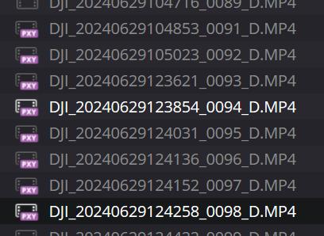

# NOTE
This script will overwrite your original .mp4 file. Backup before use!
# Introduction

DJI Air 3 automatically generate .lrf file as the low resolution version of the mp4 file that could be used as the
proxies during editing. However, there are 50/50 chance that the .lrf file is one-frame shorter than the original
video. Before DJI fix this issue, this script can help performing the following procedures:

1. Manually copy all files (.mp4, .lrf) into a folder
2. Pass the path to the directory as the argument to this script
3. The script will create a Proxy folder and move all .lrf file into it and rename to .mp4
4. The script will invoke ffmpeg to check the consistency of the proxies and original files
5. If the timecode failed to match, the script will trim the last frame of the original video

After using the script, Davinci Resolve should automatically recognize the proxy file when you drag the original file
into the media pool. If it was already in the pool, you have to manually relink the proxy or remove the media first then
re-import the files into the media pool

# Prerequisite

* ffmpeg
* python